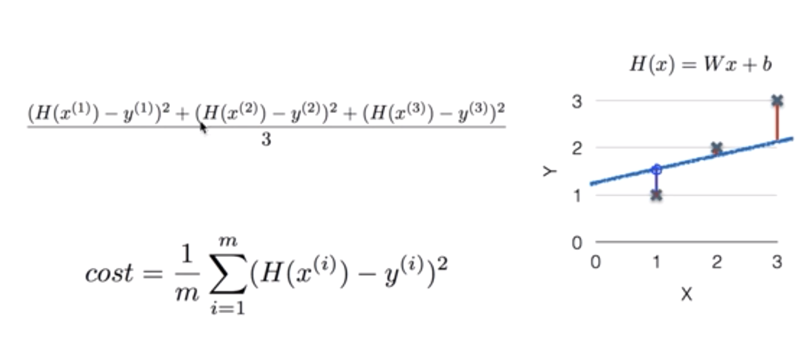
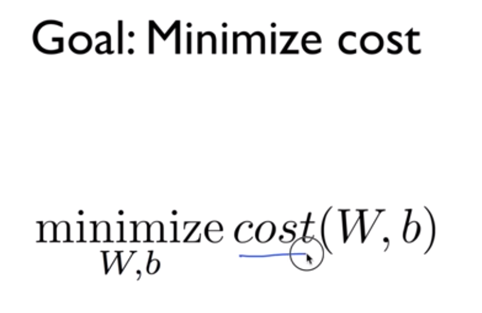

# Linear Regression  
- Linear regression의 과정 알기.    

## 1. Hypothesis(Linear) 세우기      
- 하나의 모델을 학습시키기 위해서는 하나의 선이 주어진 학습 데이터를 따른다는 가설을 세워야 한다.  
- 데이터에 맞는 선을 찾는 과정이 학습시키는 과정을 말한다.  
- H(x) = Wx + b  

## 2. Cost function  
- how fit the line to our training data  
- 세운 가설과 실제 데이터가 얼마나 다른가를 보여주는 함수  
  

  
- cost값이 가장 작을 때의 W와 b를 구하는 것이 학습의 목표  

