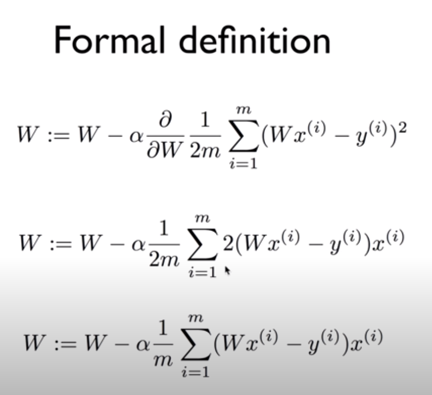

# Cost minimization algorithm  

- 데이터를 나타내는 모델을 찾기 위해서 cost를 minimize하는 과정이 필요함.  
- cost function이 나타내는 그래프를 그려보자.  
- cost function의 값이 가장 최소가 되는 지점을 찾아내는 것이 목적  
  -> 이 지점을 찾기 위해 많이 사용되는 알고리즘이 gradient descent algorithm  

## Gradient Descent Algorithm.  
- 경사를 따라 내려가는 알고리즘  
- minimize cost function  
- gradient descent is used many minimization problems  
- For a given cost function, cost(W,b), it will find W,b to minimize cost  
- It can be applied to more general function: cost(w1,w2,...)  
- 임의의 지점에서 출발하여 수렴할 때까지 경사도를 따라 움직인다.  

## How it works?  
- Start with initial guesses  
  - Start at any other value  
  - Keeping changing W and b a little bit to try and reduce cost(W,b)  
- Each time you change the parameters, you select the gradient which reduces cost(W,b) the most possible  
- Repeat  
- Do so until you converge to a local minimum  
- Has an interesting property  
  - Where you start can determine which minimum you end up  

## Derivatives  

- 기울기는 미분값을 구하여 업데이트 시켜준다.  
  

## Convex function  
- cost function이 convex function이 아닌 경우에는 시작점에 따라 minimize되는 지점이 달라질 수 있다.
  - local minimum을 global minimum으로 판단할 수 있다. 
- cost function은 항상 convex function으로 설정하는 것이 좋다.  
