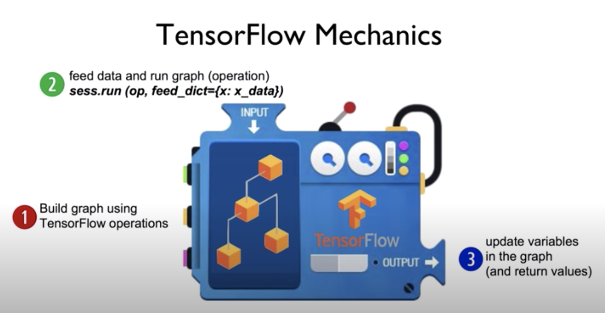
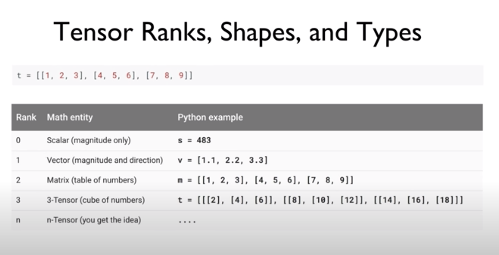
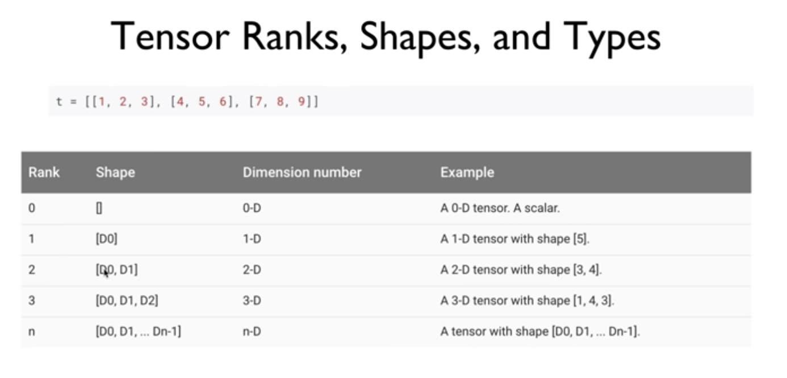
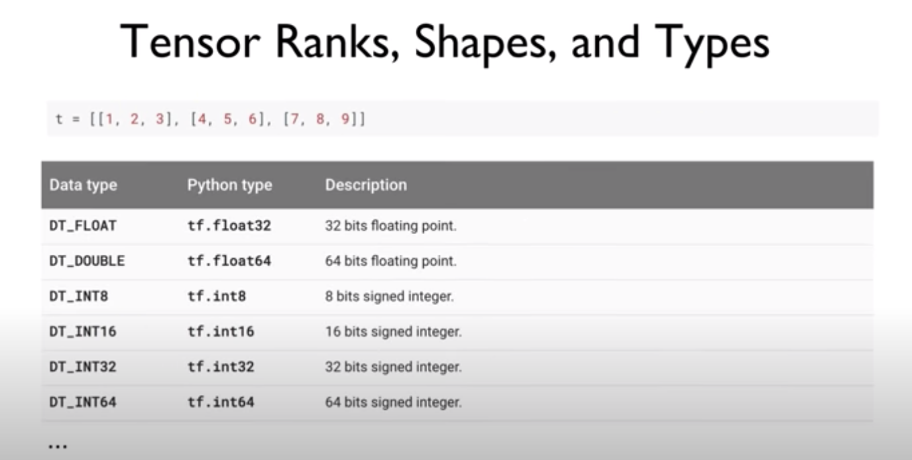

# Tensorflow  

구글에서 만든 오픈소스 라이브러리  
가장 많은 사람들이 사용하므로 공부하기 용이  

## 1. Tensorflow  
- Open source software library for **numerical computation** using data flow graphs  
- Use python  
- data flow graph  
  - 노드와 에지로 이루어진 것  
  - 노드는 수학적인 연산('operation')을 나타낸다.  
  - 에지는 간단히 데이터를 나타내는 것으로 data arrays(tensors)를 나타낸다.  
  - data flow graph에서 tensor가 돌아다니며 연산을 진행 -> tensorflow  

## 2. Install   
Linux, Max OSX, Windows  
- `pip install --upgrade tensorflow`  
- `pip install --upgrade tensorflow-gpu`
From source  
- bazel  

### 3. Tensorflow Mechanics  

1. 그래프를 build 한다.    
2. 데이터를 넣어주고 그래프를 실행시킨다.  
3. 값을 업데이트하고 반환한다.  

### 4. Tensor  

- ranks   
  

- shape  
  

- type  

